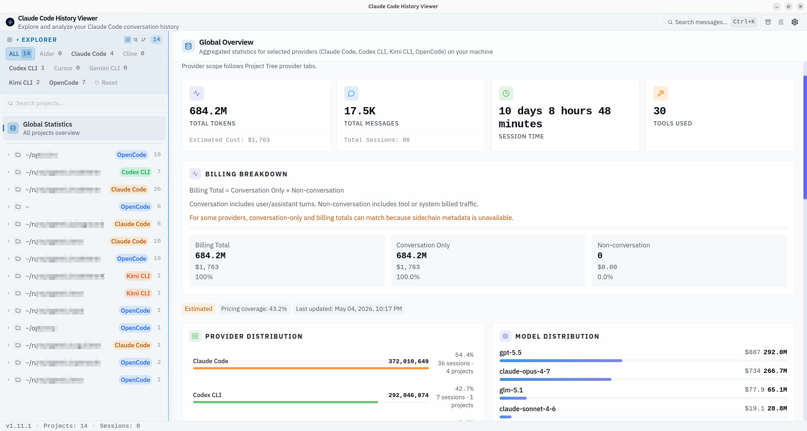

<div align="center">


# Claude Code History Viewer

**[jhlee0409/claude-code-history-viewer](https://github.com/jhlee0409/claude-code-history-viewer) のフォーク** — 追加機能と Linux 修正を含みます。

**Claude Code**、**Codex CLI**、**OpenCode**、**Kimi** (Kimi Code / Kimi CLI) などからの会話を閲覧、検索、分析 — 100% オフライン。

</div>

<div align="center">

</div>

---

## 追加機能

- **OpenCode ディレクトリベースのグループ化** — 単一の「global」プロジェクトではなく、ワークツリーごとにセッションをグループ化
- **Kimi サポート (Kimi Code & Kimi CLI)** — セッション閲覧、検索、トークン統計を備えた完全なプロバイダー。バッジは「Kimi (Code)」または「Kimi (CLI)」と表示
- **統一されたプロジェクト名** — すべてのプロバイダーが `~/path/to/project` 形式で表示
- **プロジェクト別モデル分布** — 個別プロジェクト統計ページのモデル使用分析カード
- **グローバル統計：クリック可能なトッププロジェクト** — トッププロジェクトカードのプロジェクトをクリックしてナビゲーション
- **プロバイダー別カラーバッジ** — トッププロジェクトリストのプロバイダー別バッジ（アンバー=claude、グリーン=codex、オレンジ=kimi、ブルー=opencode）
- **フォントスケール対応** — すべてのテキストがフォントスケールスライダー（90%-130%）に従います
<!-- - **サブエージェントセッションフィルタリング** — すべての統計からサブエージェントセッションを除外
- **改善されたアクティビティヒートマップ** — 大きなタイル（20px）、ポータルベースのツールチップ、ヒートマップの下にツールチャートを移動
-->

<!-- ## Linux / WebKitGTK 修正

- グローバル `OverlayScrollbars` を削除（WebKitGTK のイベント処理と競合）
- リサイズ可能パネルのドラッグ後カーソルが固まる問題を修正
- プロジェクトクリック時の 2-4 秒のフリーズを回避するためチャートレンダリングを遅延
- 要素ごとの Radix Tooltip ツリーを共有ツールチップシステムに置き換え
- トークン分布チャートの 100% 不可視アークを修正 -->

## インストール

### Linux

[最新リリース](https://github.com/astroboylrx/claude-code-history-viewer/releases/latest)から `.AppImage` をダウンロードしてください：

```bash
chmod +x Claude*.AppImage
./Claude*.AppImage
```

### Windows

[最新リリース](https://github.com/astroboylrx/claude-code-history-viewer/releases/latest)からインストーラー（`.exe`）をダウンロードしてください。

### macOS（ソースからビルド）

このアプリは有料の Apple Developer 証明書を使用していないため、プレビルドの `.dmg` をダウンロードすると macOS Gatekeeper によってブロックされます。これを回避するには、いくつかの手順でローカルでアプリをコンパイルできます。

**1. ビルド依存関係のインストール（未インストールの場合）**

`pnpm` と `rust` が必要です。Homebrew で簡単にインストールできます：

```bash
brew install node pnpm rust
```

**2. ソースコードのダウンロード**

```bash
git clone --depth 1 --branch v1.11.1 https://github.com/astroboylrx/claude-code-history-viewer.git
cd claude-code-history-viewer
```

**3. パッケージのインストールとアプリのビルド**

```bash
pnpm install --frozen-lockfile
pnpm tauri build --no-sign
```

ビルド中に Finder ウィンドウが一時的に表示されることがあります — これは正常であり、数秒後に自動的に閉じます。

**4. アプリをアプリケーションフォルダに移動**

```bash
cp -r "src-tauri/target/release/bundle/macos/Claude Code History Viewer.app" "/Applications/"
```

**5. クリーンアップ（オプション）**

ダウンロードしたソースコードフォルダを削除して容量を解放できます：

```bash
cd ..
rm -rf claude-code-history-viewer
```

## 注意事項

**macOSプライバシープロンプト:** 初回起動時、macOSが「他のAppのデータへのアクセス」権限プロンプトを表示する場合があります。これは正常な動作です — システムにインストールされたAIコーディングツールのセッション履歴を読み取るためです。すべてのプロバイダを有効にするには「許可」をクリックしてください。プロンプトは一度だけ表示されます。

## アップストリーム

オリジナルプロジェクトは [jhlee0409/claude-code-history-viewer](https://github.com/jhlee0409/claude-code-history-viewer) をご覧ください。
